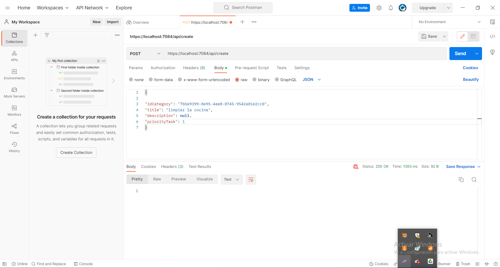

> # Nota importante
> Al iniciar este proyecto cree una clase tarea en su nombre en ingles Task, pero esta es una mala practica porque Task es una palabra reservada utilizada para la programacion asincrona.
por lo que no hagan lo mismo que yo.

## Migraciones

Las migraciones es una herramienta muy util que entity framework nos brinda para facilitarnos cambios que haremos posteriormente en nuestra base de datos a medidas que iremos avanzando con nuestro proyectos.
Para empezar necesatemos descargar la dependecia en nuestro proyecto con el siguiente codigo.

    dotnet tool install --global dotnet-ef --version 7.0.1

Este comando nos descargara la herramienta que usaremos en este simple ejemplo. Sin embargo puede haber nuevas versiones en un futuro por lo que si desea revisar les dejo en este [link](https://www.nuget.org/packages/dotnet-ef#versions-body-tab "link") la pagina para descargar.
Luego de descargar esta herramienta descargaremos otra dependencia llamada EntityFrmaeworkCore.Design con la siguiente linea de comando.

    dotnet add package Microsoft.EntityFrameworkCore.Design --version 7.0.1

Nuevamente les dejo el link para que corroboren la ultima version.[Link](https://www.nuget.org/packages/Microsoft.EntityFrameworkCore.Design#versions-body-tab "Link")

Ahora es importante no trabajar con una base de datos previamente creada, ya que eso tan solo nos dificultaria el trabajo. Por lo que si has seguido los pasos hasta ahora, vamos a tener que borrar la base de datos que hemos creado con Fluent antes de iniciar la siguiente linea de comando.

    dotnet ef migrations add InitialCreate

> Nota: InitialCreate es un nombre estandar que nos permitira saber no solo a nosotros si no al programador que vea que esta fue la primera version de nuestra migracion.

Con este comando se nos debio de haber creado una nueva carpeta llamada Migrations, en ella se van a encontrar las configuraciones que nos van a permitir trabajar en nuestro proyecto.
Ahora que tenemos lo necesario, para poder continuar vamos a tener que crear de nuevo la base de datos con el siguiente comando.

    dotnet ef database update

Ya creada nuestra base de datos, podemos ir a SQL Manager para confirmar la creacion de la base de datos. Ahora, si es que la base no esta, no te preocupes solo tienes que actualizar para encontrarla.
En nuestra nueva base de datos vamos a encontrar nuestras dos tablas iniciales a las que ya estamos acostumbrados y una tercera tabla nueva que va a contener las migraciones o cambios que se van a hacer en nuestro proyecto.

Ya sabemos crear una base de datos, pero avanzado nuestro proyecto nos topamos con la necesidad de modificar nuestra base de datos. en mi ejemplo voy a agregar una nueva porpiedad llamada **Salubrity ** en mi clase **Category**.

    public class Categoty
    {
        public Guid Id { get; set; }

        public string Name { get; set; }

        public string Description { get; set; }
        public string Salubrity {get;set;}

        public virtual ICollection<Task> Tasks { get; set; }
    }

Luego voy a ir a mi archivo TaskContext para agregar este nuevo cambio.

	modelBuilder.Entity<Categoty>(categoty =>
	{
		categoty.ToTable("Category");
		categoty.HasKey(p => p.Id);

		categoty.Property(p => p.Name).IsRequired().HasMaxLength(150);
		categoty.Property(p => p.Salubrity).IsRequired();
		categoty.Property(p => p.Description);
	});

Hecho los cambios ahora necesitamos hacer una migracion para que estos cambios se vean reflejados en nuestra base de datos. Para ello usamos la siguiente linea de codigo en nuestra terminal.

    dotnet ef migrations add ColumnSalubrityCategory

Si todo esto fue hecho correctamente podras notar que en la carpeta Migrations ahora tiene los archivos nuevos con los cambios que hicimos, pero esto no termina aqui. Necesitamos subir estos cambios para que esten en la base de datos.
En nuestra terminal escribiremos entonces el comando.

	dotnet ef database update

Si es por esas casualidadades que necesitas remover la migracion por que falto algo. la solucion es muy simple solo escribiremos en la linea de comando
	dotnet ef migrations remove

Ahora si vamos a nuestra base de datos vemos que los datos tipo string como descrition, son campos no nulos.
Esto se debe a que C# lo configura de esta manera por defecto, para evitar esto lo unico que hay que hacer es agregar al metodo IsRequired(false)

	  categoty.Property(p => p.Description).IsRequired(false);

En el caso de que necesitemos datos iniciales para trabajar con nuestra base de datos, solo tendremos que crear una lista con los datos que necesitemos. siguiendo el ejemplo.

	protected override void OnModelCreating(ModelBuilder modelBuilder)
	{
	List<Categoty> listCategory = new List<Categoty>();
	listCategory.Add(new Categoty() { Id = Guid.Parse("7b5e9399-8e95-4ae8-8745-9542a01e2cc0"), Name = "Asunto domesticos", Salubrity = "Insalubre" });
	listCategory.Add(new Categoty() { Id = Guid.Parse("0a9fa564-0604-4dfa-88df-3636fe395651"), Name = "Actividad recreativa", Salubrity = "sadudable y recomendable" });
    
    
	modelBuilder.Entity<Categoty>(categoty =>
	{
	categoty.ToTable("Category");
	categoty.HasKey(p => p.Id);

	categoty.Property(p => p.Name).IsRequired().HasMaxLength(150);
	categoty.Property(p => p.Salubrity).IsRequired();
	categoty.Property(p => p.Description).IsRequired(false);
	});

    
     	List<Task> listTask = new List<Task>();
      	listTask.Add(new Task() { Id = Guid.Parse("f5d327bf-be98-4786-81d5-0a2412b7807e"), IdCategory = Guid.Parse("7b5e9399-8e95-4ae8-8745-9542a01e2cc0"), Title = "Limpiar Baño", PriorityTask = Priority.medium, Date = DateTime.Now });
      	listTask.Add(new Task() { Id = Guid.Parse("629f9587-abc8-4c85-859f-acb762b754ed"), IdCategory = Guid.Parse("0a9fa564-0604-4dfa-88df-3636fe395651"), Title = "Practica con el arco", PriorityTask = Priority.medium, Date = DateTime.Now });
	  
	  modelBuilder.Entity<Task>(task =>
                {
                    task.ToTable("TasK");
                    task.HasKey(p => p.Id);
    
                    task.HasOne(p => p.Categoty).WithMany(p => p.Tasks).HasForeignKey(p => p.IdCategory);
    
                    task.Property(p => p.Title).IsRequired().HasMaxLength(150);
                    task.Property(p => p.Description).IsRequired(false);
                    task.Property(p => p.Date);
                    task.Property(p => p.PriorityTask).HasConversion(x => x.ToString(), x => (Priority)Enum.Parse(typeof(Priority), x));
                    task.Ignore(p => p.summary);
    
	});

Luego de haber echo los cambios y agregada la lista, es hora que agreguemos los cambios y lo subamos con los comando que ya conocemos.

	 dotnet ef migrations add InitialData
	 dotnet ef database update

> para esta altura  ya te habras dado cuenta que cada vez que hacemos un cambio usarmos el comando "Add" y cada vez que lo subimos a la base de datos usamos el comando "Update"

Ahora que tenemos una base de datos y la hemos cargados con unos datos de prueba vamos a ver si conseguimos traer los datos de la base de datos. Para hacerlo, usararemos el Map para crear un nuevo endpoin con el cual revisaremos de una manera rapida si los datos llegaron.

    app.MapGet("/api/tareas", async ([FromServices] TaskContext dbcontext) =>
    {
        return Results.Ok(dbcontext.Tasks);
    });

Corremos nuestro proyecto, entramos a la url que designamos y si en tu pantalla te aparece un archivo tipo json con los datos que cargamos anteriormente, Felicidades, losgramos conectarnos a la base de datos.
Supongamos ahora que queremos probar filtar informacion; esto seria tan sensillo como hacer uso de las sentencias Linq.

	return Results.Ok(dbcontext.Tasks.Where(p => p.PriorityTask == Priority.low));

> En este ejemplo debido a que copie y pegue, La dos veces que incerte datos en la lista lo hice con ambos con prioridad media. es por ello que cuando cambies el codigo, si no agregaste algo extra, te aparecera vacio. Es normal, porque no hay en la base de datos algun campo que cumpla con la condicion.

Ahora, supongamos que nosotros quisieramos comprobar que la relacion que teniamos entre la tablas Tasks y la tabla Categories. Eso seria tan simple como anteponer el metodo Include antes del Where.
	return Results.Ok(dbcontext.Tasks.Include(x => x.Categoty).Where(p => p.PriorityTask == Priority.medium));

Sin embargo, si seguiste este ejemplo encontraras que te dara un error. Este error es muy comun y se debe a que tenemos un nuestra clase Category una colleccion de Task, por lo que entrara en un blucle infinito.
Para evitar esto colocaremos el atributo jsonIgnore y listo ya estara andando.
	    public class Categoty
    {
        public Guid Id { get; set; }

        public string Name { get; set; }

        public string Description { get; set; }
        public string Salubrity { get; set; }

        [JsonIgnore]:
        public virtual ICollection<Task> Tasks { get; set; }
    }

Bien, ya podemos obtener y fliltar elementos de la base de datos usando Entity Framework, pero eso no es lo unico que queremos probar.
Para insertar elementos a la base de datos necesitariamos entrar al metodo MapPost y especificar el tipo de datos que estariamos insertando en la base de datos.
Luego dentro de la funcion podremos inicializar los valores que vamos a ingresar en nuestra base de datos. Para ello vamos a ingresar a Postman y en nuestro espacio de trabajo cambiaremos el metodo por el Post, entraremos en la pestaña que dice body elegiremos la opcion rar  y json como esta en la siguiente imagen.

> Nota aqui estoy cargando desde Posman las demas propiedades. Solo para mostrar que se puede desde ambas partes.

Ahora solo nos faltan dos metodos mas que son el de actualizar y el de eliminar.
Para ello haremos cosas similares que con el metodo de crear. Para actualizar usaremos el metodo MapPut para buscar elementos de nuestra tarea y desde el Postman actualizaremos los dados.

	    app.MapPut("/api/tareas/{id}", async ([FromServices] TaskContext dbcontext, [FromBody] Platzi.Models.Task tarea, [FromRoute] Guid id) =>
    {
        var tareaActual = dbcontext.Tasks.Find(id);
        if (tareaActual != null)
        {
            tareaActual.Categoty = tarea.Categoty;
            tareaActual.Title = tarea.Title;
            tareaActual.PriorityTask = tarea.PriorityTask;
            tareaActual.Date = tarea.Date;
    
            await dbcontext.SaveChangesAsync();
            return Results.Ok();
        }
        return Results.NotFound();
    });
    
En el caso de no funcionar devolvera un error 404.

Por ultomo creamos el metodo para eliminar los datos de la base de datos y con esto terminariamos nuestra web minima.

	app.MapDelete("/api/tareas/{id}", async ([FromServices] TaskContext dbcontext,[FromRoute] Guid id )=>
	{
    var tareaActual = dbcontext.Tasks.Find(id);
    if (tareaActual != null)
    {
        dbcontext.Remove(tareaActual);
        await dbcontext.SaveChangesAsync();

        return Results.Ok();
    }

    return Results.NotFound();
	});

Si llegaste hasta aqui, felicidades terminamos una API minima. ahora conoces los servicios basicos para la comunicacion de API web con ASP.NET Core y Entity Frmaework.
Si quieres saber mas aqui te dejo la [documentacion](https://learn.microsoft.com/es-es/aspnet/core/tutorials/min-web-api?view=aspnetcore-7.0&tabs=visual-studio-code "documentacion") sobre el tema.